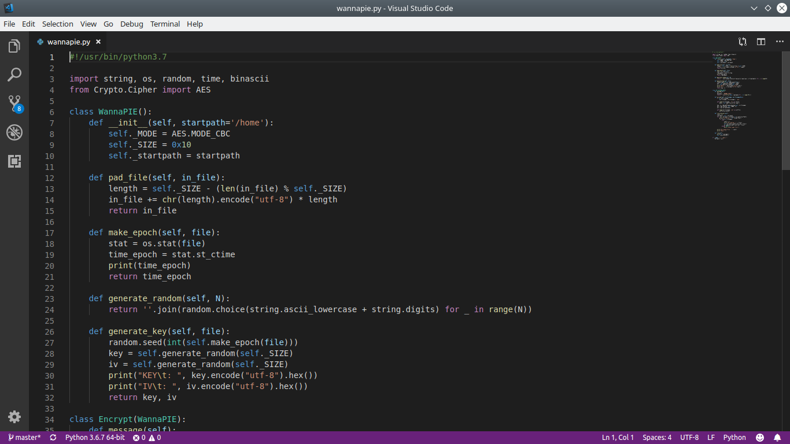
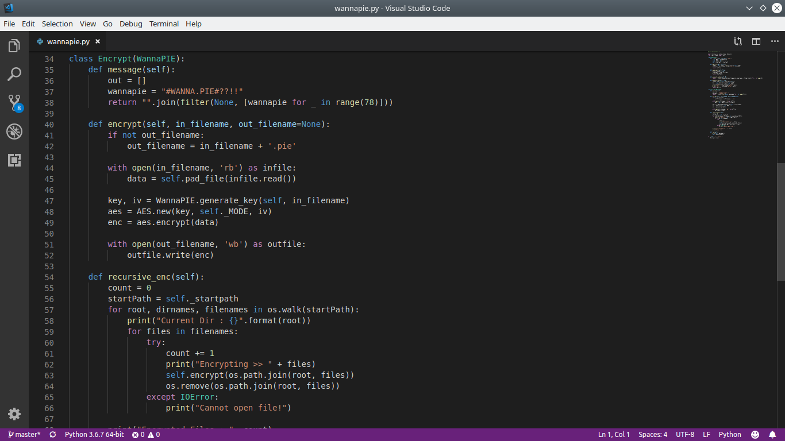
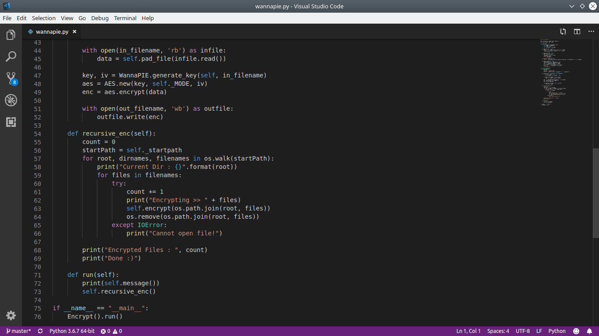
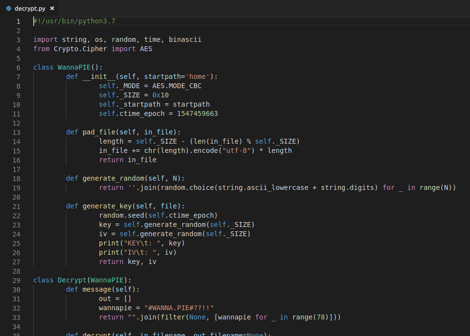
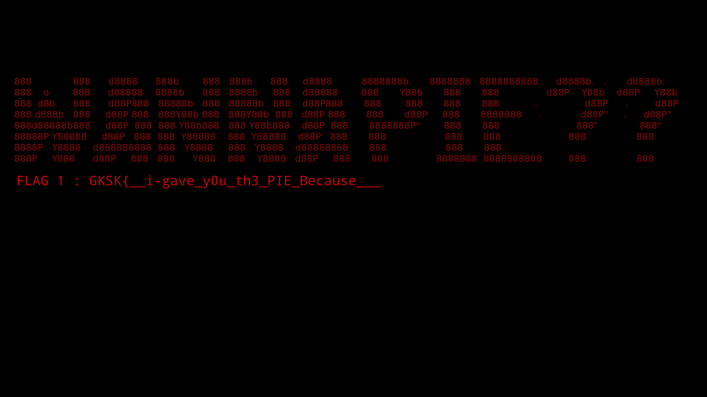
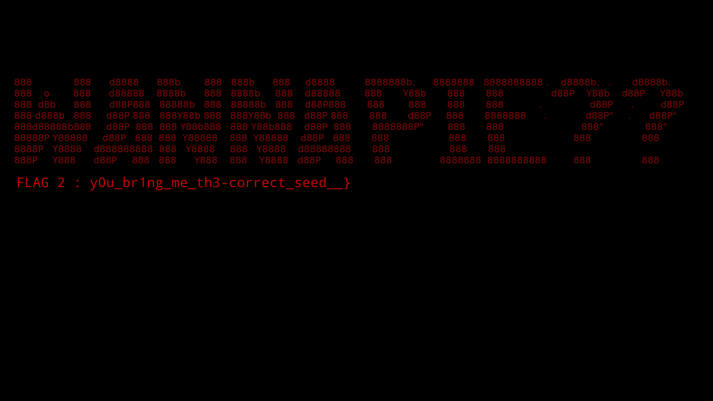

# 1. Executive Summary 

Someone send me WannaPIE and accidentally run the script and encrypted all my data. Now i can't recover my home files but luckly i have stat.info of the encrypted files, and i think it would be usefull for you as an cyber security researcher.

WARNING!
Don't run the script unless you have analyzing it and if you do, be carefull of using it. WannaPIE will encrypt your /home data recursively. If you don't want any harm activity, leave it there and try another challanges. We're not responible for any loss of data. Thankyou :) 

md5sum:
4a255c4d621f37387397f6c20e392a2d MY_DRIVE.zip 
9beb4ca1c4b715d88a2bf0023154c42 wannapie.py 

# 2. Technical Report

Given a python script below

From the script above, i knew that the encryption is using **AES-CBC** and the key is gotten from a random function.
But the random function has a seed in it so it's not actually random. In the script above, the random seed is gotten from the time epoch of change time of the encrypted file, to know the timestamp of an time epoch, i used [online epoch converter](https://epochconverter.com) to find the timestamp.
Oh right, the change time of encrypted file is in **stat.info**

Okay, we got the random seed and now we could find the **key** and **iv** for the **AES-CBC** and decrypt the encrypted file

*remember to use python 3 for the random seed because the encryption is using python 3 for the random seed*

The script that i used to find the **key** and **iv** and decrypting encrypted file is on below

Run the script and decrypt files, flag is on png file, the flag is looks like this

# 3. Flag
Flag : GKSK{\_\_i-gave_y0u_th3_PIE_Because__y0u_br1ng_me_th3-correct_seed\_\_}
