# 1. Executive Summary

Warming up is very important!

md5sum:
c5be6aeccc5e8a79b156d39ad814faf8 warmup_welcome

# 2. Technical Report

Given a binary with the detail below

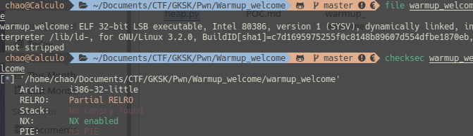

As you can see, it's a 32 bit binary with no Stack Canary and No PIE.
Not wasting much time, i decompiled it using IDA PRO and here's the result

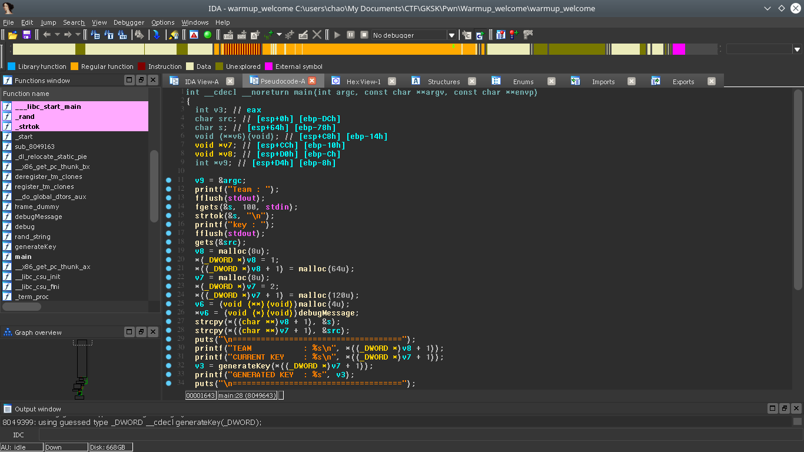
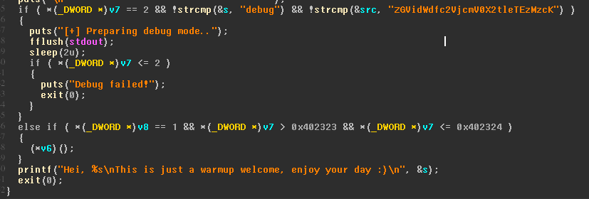
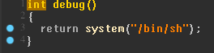

From the result above i get that:

1. The vulnerability of the program is on the input of the **key** where             **gets** doesnt limit your input and this could cause a **buffer overflow**. So now i know where to send the payload
2. To spawn a shell, we need to trigger the **debug** function where we can do that by overwriting **v6** variable and we need to fullfil some conditions, it is **v8 == 1** and **v7 == 0x402324**

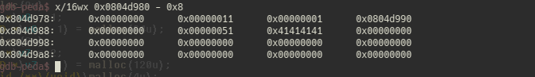

The result above is the heap of **v8** after malloc, what i can get from it is:

1. The value of **v8** is **1**
2. 0x804d980 + 1 is the address of the first **strcpy** destination

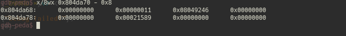

The result above is the heap of **v6** after malloc, what i can get from it is:

1. The value of **v6** is the address of **debugMessage** where we will overwrite it to **debug**

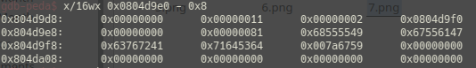

The result above is the heap of **v7** after malloc, what i can get from it is:

1. The value of **v7** is **2**
2. The value of **v7 + 1** is the address of the second **strcpy** destination

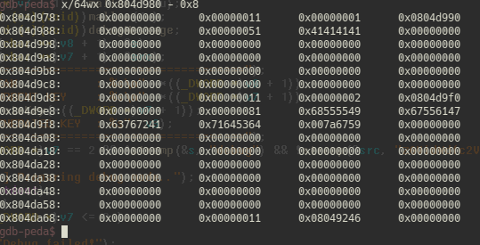

The result above is the full structure of the heap, it's time to make the padding and the payload. From the heap above, i saw the address of the **debugMessage** at the bottom of the heap. So i need to overwrite it into **debug** address, time to fuzzing down the padding in gdb

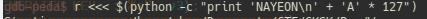

By using **python -c** i could try the padding easily, unfortunately when i fuzzing down the padding on gdb, the address of **v8** changed for some reason. For a second i was so confused and fortunately, i realized the address is changed and i still don't know why.

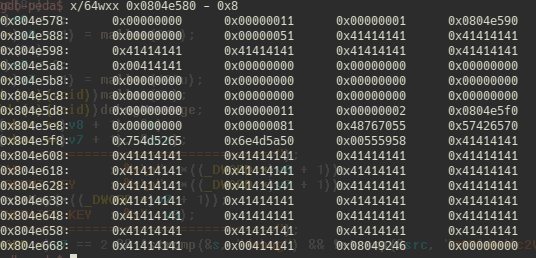

From the padding above, now i know that i need 128 "A"s to overwrite **debugMessage**

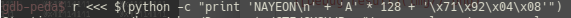

By using **python -c** again, i tried to overwrite **debugMessage**

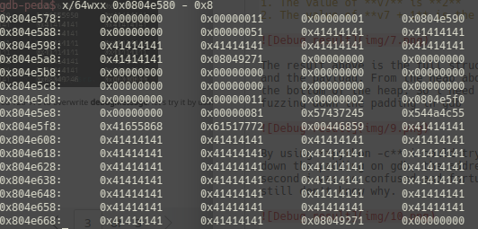

And now i overwrote the debug message, so now we need to overwrite **v7** variable. Let's fuzzing down hard for the padding in gdb

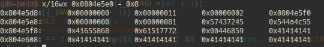

Okay, the picture above is the heap of **v7** after we overwrite **debugMessage** and before we overwrite **v7**

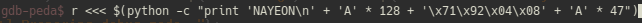

Let's try out the padding by using **python -c**

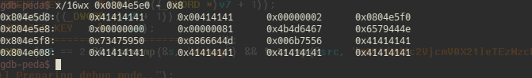

The picture above is the heap of **v7** after we tried 47 "A"s for the padding. Now i know that we need 48 "A"s to overwrite the value of **v7**

So.. i know that the first padding is 128 and the second padding is 48. Time to craft the payload, now i will craft the payload on script

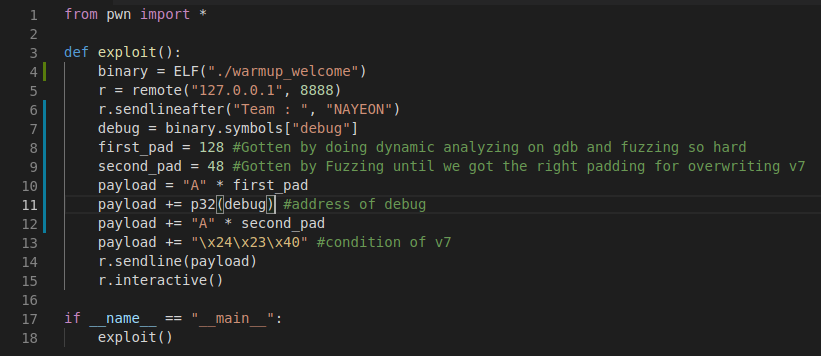

Here's the payload that i made from my analyzing result of the heap. 
Let's run the script

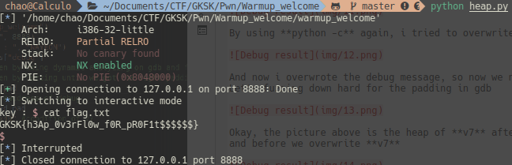

And thats how i got the shell.
This challenge is just a simple heap overflow but it's require a really good analyzing skill

# 3.Flag

Flag: GKSK{h3Ap_0v3rFl0w_f0R_pR0F1t$$$$$$}
