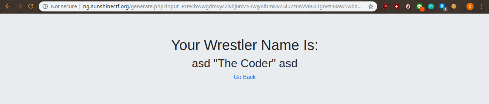
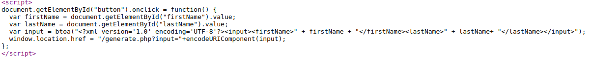
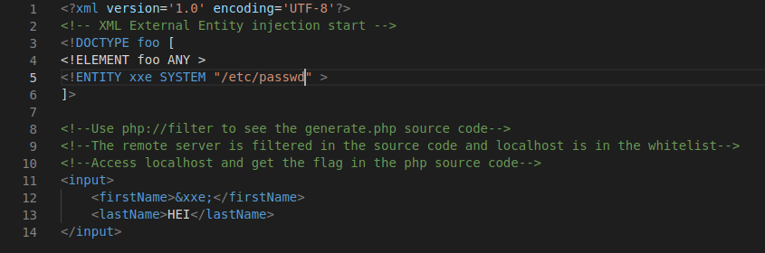
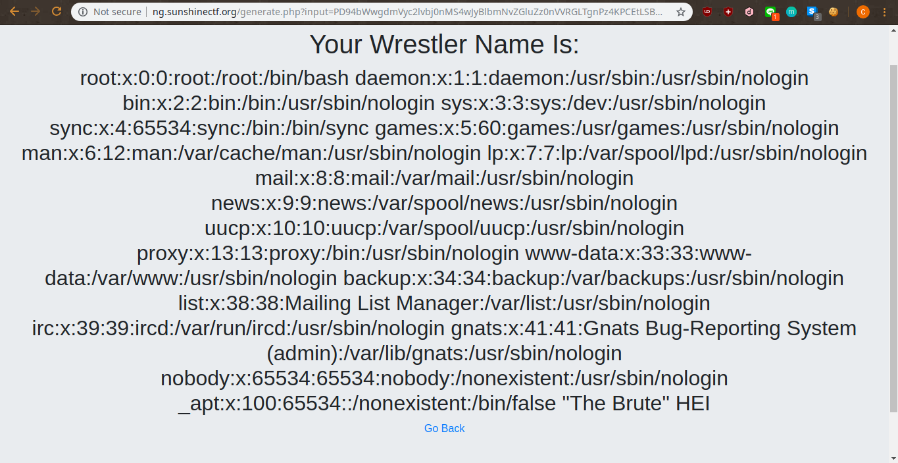
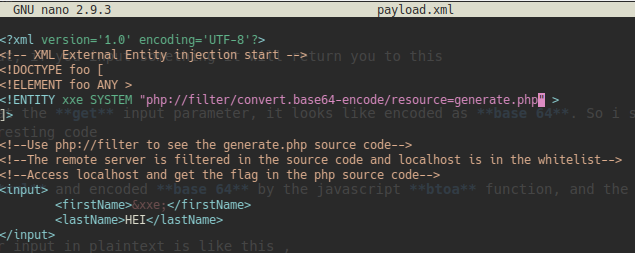
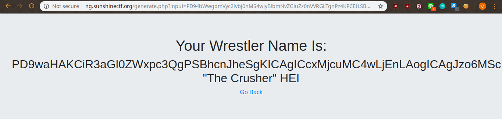
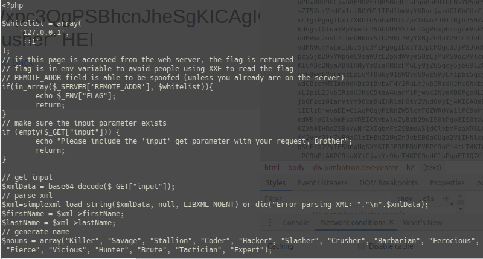
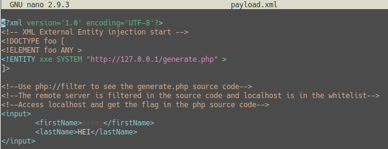
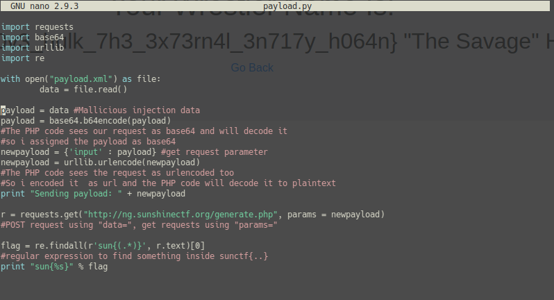
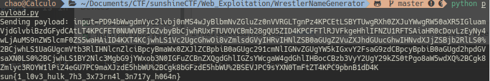

# 1.Executive Summary
Even better than the Wu-Tang name generator, legend has it that Hulk Hogan used this app to get his name.

http://ng.sunshinectf.org

# 2.Technical Report
Given a web that looks like below

It looks like asking for an input, if you input something it will return you to this

Something is interesting, look at the **get** input parameter, it looks like encoded as **base 64**. So i started to read the source code and here's the interesting code

Looks like our input is using **xml** and encoded **base 64** by the javascript **btoa** function, and the javascript code also encoded our input as **url**.

Hmm.... it's interesting, so our input in plaintext is like this , 
**<?xml version='1.0' encoding='UTF-8'?><input\><firstName\>asd</firstName\><lastName\>asd</lastName\></input\>**.
And the request method is **GET**, so why dont i just encode some **xxe injection** as **base64** and **urlencoded** as an input in the **get** parameter. So i started to try it with a simple **xxe injection**. Here's my payload

Then i decoded it as **base 64** and **url encoded** on online tools, and pass that to the **get** parameter, and this happened

So i started thinking of listing directories but it can't. Then i started to google everything and i got some interesting **php filter injection**. So here's my modified payload after a research on google

Then i encoded my payload as **base 64** and **url encoded** again so i could pass it to the **get** parameter, and here's the interesting thing

I got a long **base 64** encoded thing, i think it's the source code of **generate.php**?Let's just encode that

Hippie ! i got the source code of **generate.php**, So the PHP code will print the flag if our **REMOTE ADDRESS** is in the **whitelist** and **127.0.0.1** is in the **whitelist**. After i got this information, i immidiately made a new payload. Here's the payload

And i used python just to make myself cool, but it will be easier to read. Here's my python code

Run the python script

# 3.Flag
**sun{1_l0v3_hulk_7h3_3x73rn4l_3n717y_h064n}**